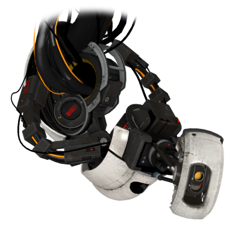

## GLaDOS




GLaDOS is a opensource game engine that runs on MacOS, Windows and Linux.

### Build

GLaDOS use CMake build backend.

```
mkdir build
cd build
cmake -G Ninja ..
ninja
```

If your machine does not have needed dependencies, install on your target machine.
On MacOS, you can easily install it like below

```
brew install catch2 google-benchmark
```

### Features

- Supporting texture format (JPEG, PNG, TGA, BMP, PSD, GIF, HDR, PIC, PNM)
- CPU bounded Mipmaps texture generation
- Model loading and rendering (DAE, FBX, glTF, OBJ, PLY, STL etc...)
- Handmade bunch of Math classes (Vec2, Vec3, Vec4, Quat, Mat4, Angle, Rect, Point)
- ECS system inspired by unity ECS
- 2D, 3D Animation system (keyframe, skinning, rigging, blending)
- 2D Sprite rendering
- Custom memory allocator for easy to debug
- Handmade JSON parser
- Various kind of Thread safe data structure
- Platform independent rendering abstraction (DirectX12, Metal, Vulkan support)
- (TODO) Inverse Kinematics (IK solver)
- (TODO) Collision detection
- (TODO) various Light (Point, Directional, Spot)
- (TODO) audio loader and play (WAV, OGG)
- (TODO) compressed Texture loading (DXT, BC)
- (TODO) Terrain heightmap brush, texture splatting
- (TODO) PBR material system
- (TODO) Shader graph

### Sample

'sample' directory contains various JIT demos.

- 01-setup: simple window and init engine demo.

### Build on your project (MacOS version)

1. Grep all the .h, .hpp files into your project include directory.
```
cd src
find . -name '*.h' -o -name '*.hpp' | cpio -pdm ~/your/project/include
```

2. Build GLaDOS static library and copy to your library directory.
```
mkdir build && cd build
cmake .. -GNinja -DCMAKE_BUILD_TYPE=Release
ninja
cp libGLaDOS.a /path/to/your/project/lib
```

3. Write your proejct main.cpp source code like below then compile on your target compiler.
```c++
#include <GLaDOS.h>

using namespace GLaDOS;

int main() {
  PlatformParams params{1024, 800, "hello, world", "GLaDOS", false};
  if (!Platform::getInstance().initialize(params)) {
    std::cout << "init failed" << std::endl;
    return -1;
  }
  while (Platform::getInstance().isRunning()) {
    Platform::getInstance().update();
  }
  return 0;
}
```
Compile
```
g++ main.cpp -std=c++1z -Iinclude -Llib -lGLaDOS -lobjc -framework Metal -framework Cocoa -framework QuartzCore -o test
./test
```

### Build on your project (Linux version)

1. install every tools to build GLaDOS
```
sudo apt install build-essential libx11-dev mesa-vulkan-drivers libvulkan-dev libbenchmark-dev cmake ninja-build assimp-utils
```

2. clone Catch2 dependencies
```
git clone https://github.com/catchorg/Catch2
cd Catch2 && mkdir build && cd build && cmake ..
make
sudo make install
```

3. The same as MacOS installation.

### clang-format

before run clang-format-all shell script, you should install dependencies

```
brew install coreutils clang-format
```

then run it.
```
./clang-format-all src
```

### License

no license yet.
